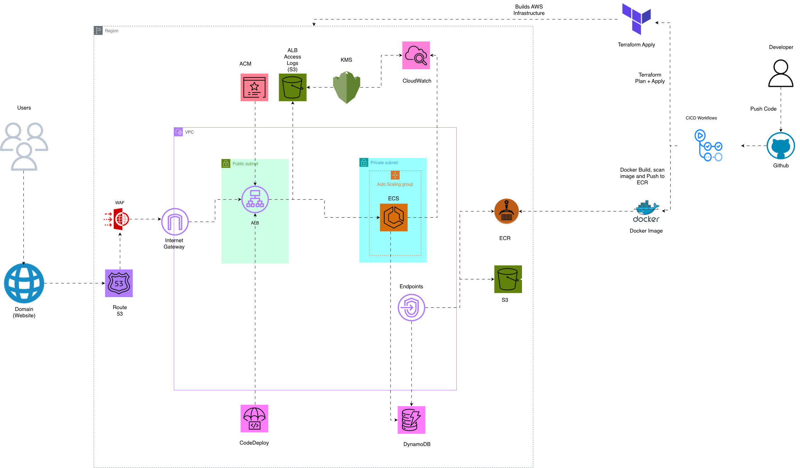
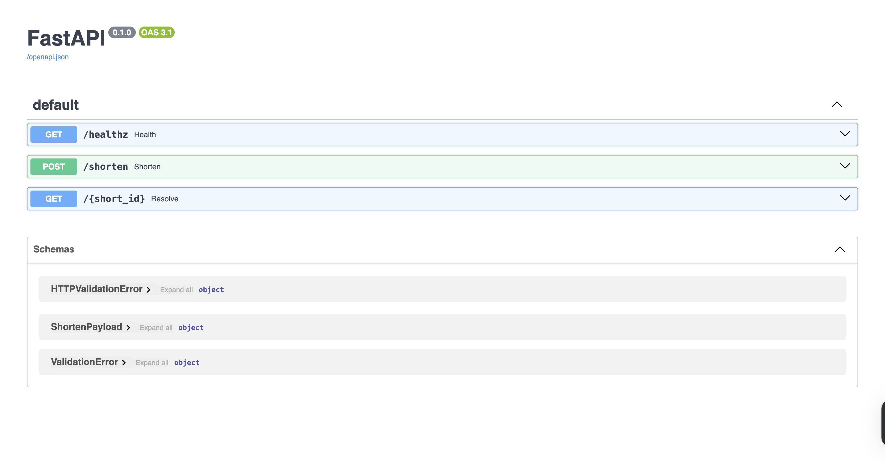

# URL Shortener on AWS ECS

A production-ready URL shortener service deployed on AWS ECS Fargate with blue/green deployments, VPC-only connectivity, WAF protection, and CI/CD automation via GitHub OIDC.

## Architecture



## Architecture Highlights

### Core Infrastructure

- **ECS Fargate** service running FastAPI in containers
- **Application Load Balancer (ALB)** with HTTPS termination
- **AWS WAF** protecting the ALB with managed rule sets
- **DynamoDB** for URL mappings (PAY_PER_REQUEST with PITR enabled)
- **Private subnets only** — no public IPs on tasks
- **VPC Endpoints** for ECR, S3, DynamoDB, and CloudWatch Logs (no NAT gateways)
- **Blue/Green deployments** via AWS CodeDeploy with automatic rollback
- **GitHub Actions CI/CD** using OIDC (no long-lived credentials)

### Security & Compliance

- Least-privilege IAM roles for ECS tasks (DynamoDB `GetItem`/`PutItem` only)
- KMS CMK encryption for DynamoDB at rest
- Security groups restricting ingress to ALB only
- WAF rules: Common Rule Set, IP Reputation, Known Bad Inputs, and more

## Repository Structure

```
url-shortener-app/
├── app/                    # Python FastAPI application
├── terraform/              # Infrastructure as Code (Terraform modules)
├── deployment/             # CodeDeploy configuration
├── .github/workflows/      # GitHub Actions CI/CD pipelines
├── images/                 # Architecture diagrams and screenshots
└── README.md
```

## Getting Started

### Prerequisites

- AWS Account with appropriate permissions
- Terraform >= 1.12.2
- Docker (for local testing)
- GitHub repository with Actions enabled

## CI/CD Pipeline

### GitHub Actions Workflows

#### 1. CI Workflow (`.github/workflows/ci.yaml`)

- **Triggers:** Manual (`workflow_dispatch`)
- **Jobs:**
  - Build Docker image for ARM64 architecture
  - Scan image with Trivy vulnerability scanner
  - Push image to Amazon ECR

#### 2. Terraform Plan (`.github/workflows/tfplan.yaml`)

- **Triggers:** Manual (`workflow_dispatch`)
- **Jobs:**
  - Run Checkov security scanning
  - Run TFLint for Terraform best practices
  - Initialise Terraform backend
  - Validate and format Terraform code
  - Select/create workspace (dev/staging/prod)
  - Generate Terraform plan

#### 3. Terraform Apply (`.github/workflows/tfapply.yaml`)

- **Triggers:** Manual (`workflow_dispatch`)
- **Jobs:**
  - Initialise Terraform
  - Select workspace
  - Apply Terraform changes

#### 4. Terraform Destroy (`.github/workflows/tfdestroy.yaml`)

- **Triggers:** Manual (`workflow_dispatch`)
- **Jobs:**
  - Destroy all infrastructure resources
  - ⚠️ **Use with caution**

### AWS Authentication

All workflows use **GitHub OIDC** to assume an AWS IAM role. No long-lived credentials are stored in GitHub Secrets. The workflows require:

- `permissions.id-token: write` in the workflow file
- `AWS_IAM_ROLE_ARN` secret containing the IAM role ARN
- IAM role trust policy allowing GitHub Actions to assume the role

## Deployment

### Manual Deployment

```bash
cd terraform

# Initialise and select workspace
terraform init
terraform workspace select environment || terraform workspace new environment

# Plan
terraform plan -var-file=environments/environment/environment.terraform.tfvars

# Apply
terraform apply -var-file=environments/environment/environment.terraform.tfvars
```

### Blue/Green Deployments

CodeDeploy manages blue/green deployments with:

- **Two target groups** (blue and green) for zero-downtime deployments
- **Automatic rollback** on failed health checks
- **Canary deployment** option (currently configured as `ECSAllAtOnce`, can be changed to `ECSCanary10Percent5Minutes`)
- **Health check path:** `/healthz`

## Infrastructure Details

### VPC Architecture

- **Public subnets:** ALB only
- **Private subnets:** ECS tasks (no public IPs)
- **VPC Endpoints:**
  - ECR (API + DKR) — Interface endpoints for pulling images
  - S3 — Gateway endpoint for state and artifacts
  - DynamoDB — Gateway endpoint for table access
  - CloudWatch Logs — Interface endpoint (if configured)
- **No NAT Gateways:** All AWS service access via VPC endpoints

### Application Configuration

- **Container port:** 8080
- **Environment variable:** `TABLE_NAME` (DynamoDB table name)
- **Health check:** `GET /healthz` returns `{"status": "ok"}`
- **ECS Task Role:** Limited to DynamoDB `GetItem` and `PutItem`
- **ECS Execution Role:** ECR pull and CloudWatch Logs write permissions

### DynamoDB

- **Billing mode:** PAY_PER_REQUEST
- **Encryption:** KMS CMK
- **Point-in-time recovery (PITR):** Enabled
- **Table structure:**
  - Partition key: `short_id` (string)
  - Attributes: `url` (string)

### AWS WAF

WAF is attached to the ALB with the following managed rule sets:

- AWS Managed Rules Common Rule Set
- AWS Managed Rules Linux Rule Set
- AWS Managed Rules Amazon IP Reputation List
- AWS Managed Rules Anonymous IP List
- AWS Managed Rules Known Bad Inputs Rule Set
- AWS Managed Rules Unix Rule Set
- AWS Managed Rules Windows Rule Set

## Decisions & Trade-offs

### Architecture Decisions

- **ECS Fargate over Lambda:** Better suited for containerised apps with persistent connections and predictable performance
- **Private subnets only:** Enhanced security by eliminating public IP exposure
- **VPC Endpoints over NAT Gateways:** Cost savings (~$32/month per NAT gateway) while maintaining connectivity
- **PAY_PER_REQUEST DynamoDB:** Suitable for variable/unpredictable traffic; scales automatically
- **Blue/Green via CodeDeploy:** Zero-downtime deployments with automatic rollback capability

### Security Trade-offs

- **WAF managed rules:** Balances security and flexibility; some rules may need tuning for specific use cases
- **Least-privilege IAM:** Task role limited to DynamoDB operations only; execution role for ECR and logs
- **KMS CMK encryption:** Adds cost but provides full key management control

### Cost Considerations

- **No NAT Gateways:** Significant cost savings (~$32/month + data transfer per AZ)
- **VPC Endpoints:** Interface endpoints incur hourly charges (~$7/month + data processing)
- **ALB + WAF:** Fixed hourly costs + per-GB/request charges
- **DynamoDB PAY_PER_REQUEST:** Pay only for actual usage, but storage costs apply

### Common Issues

#### ECS Tasks Not Starting

- Check CloudWatch Logs for container errors
- Verify task execution role has ECR pull permissions
- Confirm security groups allow traffic from ALB
- Verify VPC endpoints are configured correctly

#### DynamoDB Access Denied

- Verify ECS task role includes `dynamodb:GetItem` and `dynamodb:PutItem`
- Check table name matches `TABLE_NAME` environment variable
- Confirm VPC endpoint routing for DynamoDB

#### CodeDeploy Deployment Fails

- Check CodeDeploy deployment status in AWS Console
- Review CloudWatch metrics for health check failures
- Verify both blue and green target groups are configured
- Check ECS service events for task placement failures

### Rollback

**Application Rollback:**

- Revert to previous container image tag in ECS task definition
- Re-run Terraform apply or trigger CodeDeploy deployment

**Infrastructure Rollback:**

- Revert Terraform commit
- Run `terraform plan` and `terraform apply` with previous configuration

## Monitoring

- **CloudWatch Logs:** ECS task logs, ALB access logs (optional), WAF logs
- **CloudWatch Metrics:** ECS service metrics, ALB request/response metrics, WAF metrics
- **Container Insights:** Recommended for detailed ECS performance metrics

## Application Screenshot



The FastAPI interactive API documentation showcasing the live URL shortener service endpoints.
