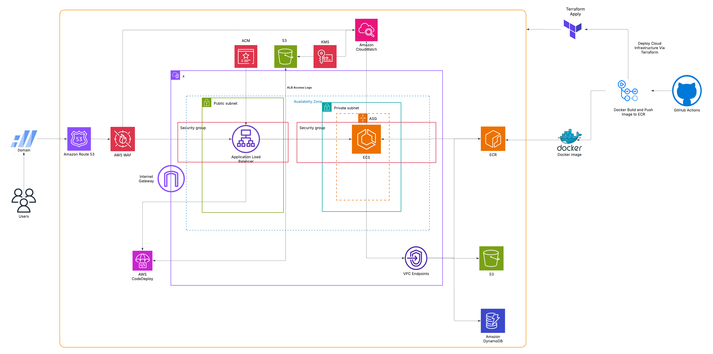

## URL Shortener — Infrastructure-First Documentation

Production deployment of a FastAPI-based URL shortener on AWS using Terraform and GitHub Actions. This document focuses on infrastructure, environments, CI/CD, security, and operations (no local setup instructions).



### Highlights

- ECS Fargate service behind an Application Load Balancer (HTTPS)
- DynamoDB PAY_PER_REQUEST with KMS CMK encryption and PITR
- Route53 DNS, optional AWS WAF, and ECS Service autoscaling
- Modular Terraform with workspaces for dev/staging/prod
- GitHub Actions for plan/apply/destroy plus Checkov and TFLint

### Repository layout

- `terraform/` — Infrastructure as Code
  - `modules/` — `networking`, `ecs`, `alb`, `dynamodb`, `endpoints`, `route53`, `waf`, `codedeploy`, `autoscaling`
  - `environments/{dev,staging,prod}/*.tfvars` — per-environment inputs
  - `0-provider.tf`, `1-backend.tf`, `2-main.tf`, `3-variables.tf`
- `app/` — Dockerized FastAPI service (built and run within AWS)

### Application endpoints (for ALB health and routing)

- GET `/healthz` — health check (used by target group)
- POST `/shorten` — returns `{ short, url }`
- GET `/{short_id}` — 307 redirect to original URL

## Terraform

### Structure

```
terraform/
  modules/           # networking, ecs, alb, dynamodb, waf, codedeploy, autoscaling, endpoints
  environments/
    dev/dev.terraform.tfvars
    staging/staging.terraform.tfvars
    prod/prod.terraform.tfvars
  0-provider.tf
  1-backend.tf       # S3 backend; workspaces enabled
  2-main.tf          # module wiring
  3-variables.tf
```

### State, workspaces, and locking

- Backend: S3, defined in `terraform/1-backend.tf`.
- Workspaces are used; state keys are prefixed automatically with `env:/<workspace>/...`.
- Recommended: enable DynamoDB state locking by passing `-backend-config` at init time per environment. Example:

```bash
cd terraform
terraform init -backend-config="dynamodb_table=dev-dynamodb-table"
```

If DynamoDB locking is not enabled, S3 lockfiles are used (`use_lockfile = true`). Avoid overlapping runs.

### Standard plan/apply flow (manual)

```bash
cd terraform
terraform init
terraform fmt && terraform validate
terraform workspace select dev || terraform workspace new dev
terraform plan -var-file=environments/dev/dev.terraform.tfvars
terraform apply -var-file=environments/dev/dev.terraform.tfvars
```

The DynamoDB module creates `${env}-dynamodb-table`. The app reads `TABLE_NAME` from the ECS task environment.

## CI/CD (GitHub Actions)

### Workflows

- `.github/workflows/ci.yaml` — basic CI
- `.github/workflows/tfplan.yaml` — Checkov, TFLint, Terraform init/validate, workspace select, plan
- `.github/workflows/tfapply.yaml` — init, workspace select, apply
- `.github/workflows/tfdestroy.yaml` — destroy flow

### AWS authentication

- Uses GitHub OIDC to assume an AWS IAM role.
- Required secrets:
  - `AWS_IAM_ROLE_ARN` or `AWS_ROLE_ARN` (as referenced in the workflows)

### Deployment via workflows

1. Trigger “Terraform Plan” (manual `workflow_dispatch`).
2. Review plan output in the job logs.
3. “Terraform Apply” runs automatically if configured to follow plan success, or trigger it manually.

### Workflow configuration notes

- Environment selection is handled via workspaces and `-var-file=environments/<env>/*.tfvars`.
- Consider adding workflow `concurrency` to prevent overlapping plans on the same workspace.
- To use DynamoDB state locking, update the init step to include `-backend-config="dynamodb_table=<env>-dynamodb-table"`.

## Security and compliance

- KMS CMK for DynamoDB encryption at rest; PITR enabled.
- Least-privilege IAM for ECS task execution and DynamoDB access (`GetItem`, `PutItem`).
- ALB with HTTPS termination and optional AWS WAF association.
- Private subnets for tasks, security groups restricting ingress from ALB only.

## Observability

- CloudWatch Logs for ECS tasks and ALB access logs (if enabled).
- Health endpoint at `/healthz` for target group health checks.
- Container Insights recommended for ECS cluster metrics.

## Operations

### Rollback

- Re-run apply with a previous known-good container image tag by updating task definition references (as wired in the ECS module), then apply.
- For infra-only changes, revert the Terraform commit and re-run plan/apply.

### Destroy

- Trigger the `tfdestroy` workflow, or run `terraform destroy -var-file=environments/<env>/<env>.terraform.tfvars` from the `terraform/` directory.

## Troubleshooting

### Terraform 412 PreconditionFailed (S3 state lock)

- Cause: concurrent run or stale S3 `.tflock` object.
- Fix: delete the lock object under the state key prefix, avoid overlaps, and prefer DynamoDB locking (`-backend-config="dynamodb_table=<env>-dynamodb-table"`).

### DNS/HTTPS not resolving

- Verify Route53 record targets the ALB and ACM certificate is validated in the deployment region.

### Access denied to DynamoDB

- Ensure the ECS task role includes `dynamodb:GetItem` and `dynamodb:PutItem` for the environment table.

## License

MIT
